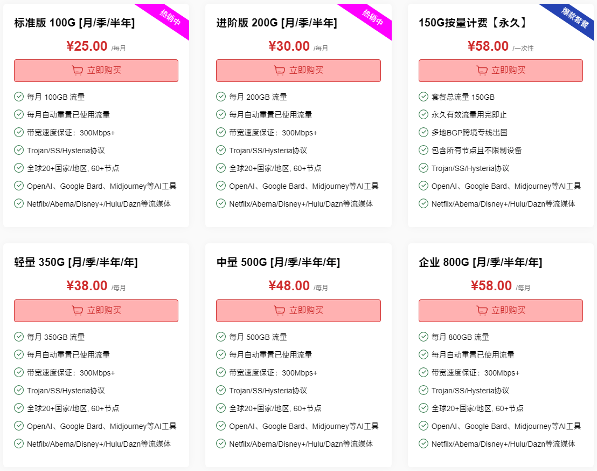

# 可乐云(colacloud)官网地址

永久官网：[colacloudnet.com](https://user.colacloudnet.com/#/register?code=puWPu829)

备用地址：[colacloud.net](https://merlin.colacloud.net/#/register?code=puWPu829)

---

**温馨提示：任何服务均有跑路风险，请自行注意防范！**

**本页面仅分享网络信息，不做推荐，有问题请自行联系服务商处理！**

---

## 可乐云(colacloud)简介

可乐云(colacloud)，也称可乐云在线，为用户提供最快速，稳定和安全的端点，可以放心地访问高速国际互联网。可乐云目标在通过智能路由、实时监控、全球数据中心和尖端加密等技术提供稳定的服务。

支持解锁ChatGPT 以及 Netflix、Hulu、HBO、YouTube Premium、Disney Plus等流媒体，4K超清精彩呈现。

## 可乐云(colacloud)优惠码

2025国庆75折优惠券 全部产品可用

优惠码：[20251001](https://merlin.colacloud.net/#/register?code=puWPu829)

## 可乐云(colacloud)特色

* Trojan/SS/Hysteria协议节点，可满足日常绝大部分应用场景或技术需求。
* 服务器部署在全球各地，中转线路包括香港/台湾/日本/美国/加拿大/欧洲/新加坡/韩国等。
* 支持解锁ChatGPT 以及 Netflix、Hulu、HBO、YouTube Premium、Disney Plus等流媒体。
* 老牌平价稳定网络解锁服务。

## 可乐云(colacloud)套餐价格

￥25/月/100G流量起，年付价格更优惠。

还有一个特色按量计费套餐：[¥58.00 /一次性150G](https://user.colacloudnet.com/#/register?code=puWPu829) 按量计费，永久有效流量用完即止。

详细套餐介绍参考下图表：

2025-09-05：可乐云网络周期套餐加量不加价  🎉新老用户同享🎉

* 标准版 100G  升级至 150G
* 进阶版 200G 升级至 280G
* 轻量版 350G 升级至 500G
* 中量版 500G 升级至 700G

---

**温馨提示：任何服务均有跑路风险，请自行注意防范！**

**本页面仅分享网络信息，不做推荐，有问题请自行联系服务商处理！**

---
